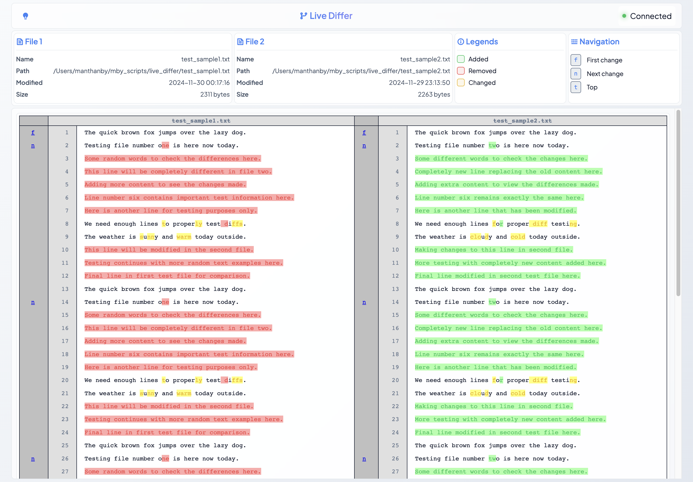

# Live Differ

A real-time file difference viewer that automatically updates when files change. Live Differ provides an intuitive web interface for comparing files side-by-side with real-time updates when either file is modified.



## Features

- Real-time file difference visualization
- Automatic updates when files change
- Side-by-side comparison view
- Modern command-line interface with auto-completion
- File metadata display
- Comprehensive error handling and logging
- Environment variable support for configuration
- Development-friendly debug mode

## Installation

1. Clone the repository:
```bash
git clone <repository-url>
cd live_differ
```

2. Create and activate a virtual environment (recommended):
```bash
python -m venv .venv
source .venv/bin/activate  # On Unix/macOS
# or
.venv\Scripts\activate     # On Windows
```

3. Install dependencies:
```bash
pip install -r requirements.txt
```

## Usage

Live Differ now features a modern command-line interface with various options and automatic help:

### Basic Usage

Compare two files with default settings:
```bash
python cli.py file1.txt file2.txt
```

### Advanced Usage

```bash
# Custom host and port
python cli.py file1.txt file2.txt --host 0.0.0.0 --port 8000

# Enable debug mode
python cli.py file1.txt file2.txt --debug

# View all available options
python cli.py --help
```

### Using Environment Variables

All configuration options can be set using environment variables:

```bash
# Set configuration via environment variables
export FLASK_HOST=0.0.0.0
export FLASK_PORT=8000
export FLASK_DEBUG=1

# Run with environment configuration
python cli.py file1.txt file2.txt
```

After starting the server, open your browser and navigate to the displayed URL (default: `http://127.0.0.1:5000`).

## Configuration

The application supports various configuration options:

| Option | Environment Variable | Default | Description |
|--------|---------------------|---------|-------------|
| Host | FLASK_HOST | 127.0.0.1 | Server host address |
| Port | FLASK_PORT | 5000 | Server port number |
| Debug Mode | FLASK_DEBUG | False | Enable debug mode |

### Command-Line Options

```
Options:
  -h, --host TEXT          Host to bind the server to [default: 127.0.0.1]
  -p, --port INTEGER       Port to run the server on [default: 5000]
  --debug                  Enable debug mode
  --help                   Show this message and exit.
```

## Development

### Directory Structure

```
live_differ/
├── app.py          # Main Flask application
├── cli.py          # Command-line interface
├── modules/        # Core functionality modules
├── static/         # Static files (CSS, JS)
├── templates/      # HTML templates
├── logs/           # Application logs
└── requirements.txt # Project dependencies
```

### Logging

Logs are written to `logs/app.log` with the following features:
- Rotation enabled (10MB max size)
- Keeps 10 backup files
- Includes timestamps, log levels, and source information
- Comprehensive error tracking

### Error Handling

The application includes robust error handling:
- File validation (existence, permissions)
- UTF-8 encoding validation
- Input parameter validation
- Detailed error pages with helpful messages
- Comprehensive error logging

## Security Considerations

The application implements several security measures:
- File size limit of 16MB to prevent memory issues
- Input validation for all file paths and parameters
- No execution of file contents
- Local-only file access
- Debug mode disabled by default

## Contributing

Contributions are welcome! Please feel free to submit a Pull Request.

## License

[Add your license here]
